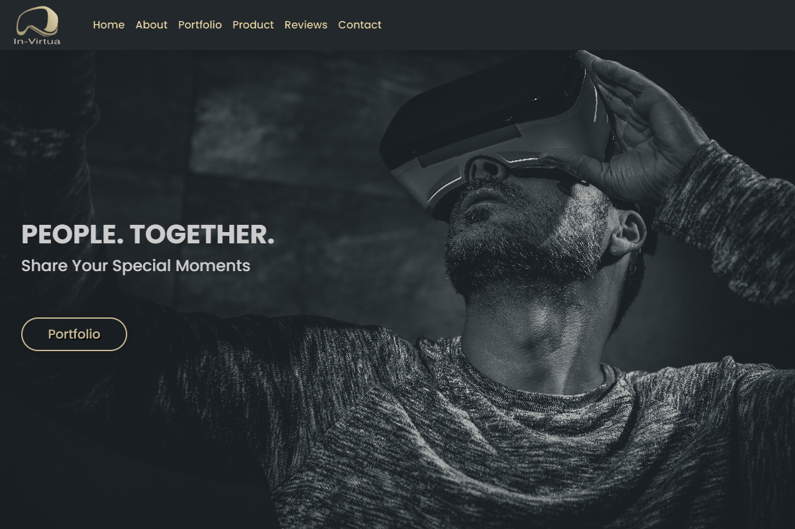

# in-Virtua page
This is the page of a virtual reality startup called in-Virtua. The page is about showcasing and explaining their work and also about what they can do for potential customers. It's built with React and uses packages for the slider, text animations and qoutes carousel. It also has full page scrolling and is fully responsive.

# Design
View this project at: https://bejewelled-trifle-ec8c87.netlify.app/

